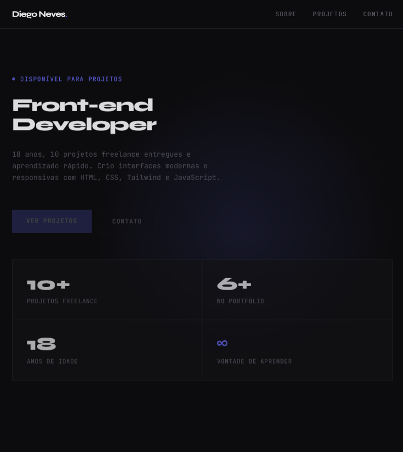

# Diego Neves — Portfólio

Site pessoal de apresentação: projetos, trajetória e contato.



## Sobre

Página única construída para responder três perguntas rápido: **quem é**, **o que fez** e **como falar comigo**. O foco foi clareza e velocidade — nada de peso desnecessário.

Seções:

- **Sobre** — apresentação e disponibilidade para projetos
- **Projetos** — trabalhos entregues
- **Contato** — canais diretos

## Stack

| Camada | Tecnologia |
|---|---|
| Build | Vite |
| Estilos | Tailwind CSS + PostCSS |
| Ícones | Font Awesome |
| Deploy | GitHub Pages (`gh-pages`) |

## Rodar localmente

```bash
git clone https://github.com/Diegoww12a/portf-lio.git
cd portf-lio
npm install
npm run dev
```

O servidor sobre em `http://localhost:5173`.

## Build e publicação

```bash
npm run build        # gera dist/
npm run deploy       # build:github + gh-pages -d dist
```

## Estrutura

```
├── index.html          # ponto de entrada
├── src/                # componentes e estilos
├── public/             # assets estáticos
├── tailwind.config.js  # design tokens
├── postcss.config.js
└── vite.config.js
```

## Autor

**Diego Neves** — Desenvolvedor Full Stack

React · Vite · Tailwind CSS
